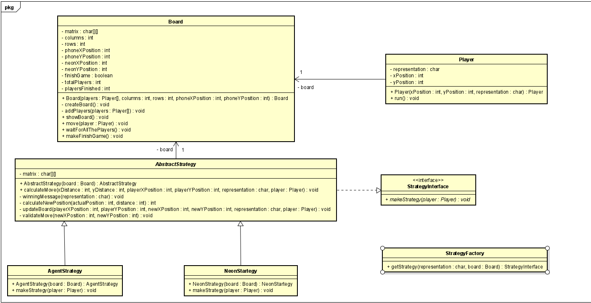

# 🎮 MatrixGame

## 📌 Introducción

**MatrixGame** es un juego desarrollado en Java como un trabajo introductorio al manejo de hilos (threads) y a la sincronización de procesos concurrentes.  
El proyecto fue construido utilizando **Maven** como gestor de dependencias y herramientas como **Lombok** para reducir el código repetitivo y mejorar la legibilidad del proyecto.

El juego se ejecuta completamente en la consola y funciona de manera automática, sin intervención directa del usuario.  
El objetivo principal del proyecto no es solo el entretenimiento, sino comprender y aplicar conceptos fundamentales como:

- Programación concurrente.
- Uso de `synchronized`.
- Coordinación de múltiples hilos.
- Control de turnos entre entidades del juego.

El tablero está compuesto por diferentes tipos de jugadores:

- **N (Neon):** personaje principal que intenta llegar al objetivo.
- **A (Agent):** enemigos que persiguen a Neon.
- **T (Target):** destino final que Neon intenta alcanzar.

Los agentes siguen a Neon e intentan atraparlo, mientras que Neon se mueve buscando llegar a la posición **T** antes de ser alcanzado.

---

## 🧩 Diseño

- Para el diseño se creó Player que extiende la clase runnable, esta clase tiene como atributo un tablero que todos los hilos van a compartir para desarrollar la estrategia de sincronización.
- Se implementó un patron de fábrica, pensando en la extensibilidad del proyecto facilitando el posible desarrollo de nuevas estrategias.
- En el diseño se buscó mantener el juego simple, puesto que el objetivo principal del proyecto es una introducción al trabajo con hilos; aun así, se conservaron buenas prácticas en su implementación.

---

## 🧠 Estrategia de manejo de hilos

El juego fue diseñado bajo un enfoque donde **cada jugador es un hilo independiente**.  
Esto significa que tanto Neon como cada uno de los agentes se ejecutan en su propio ciclo de ejecución (`run`), permitiendo simular movimientos simultáneos dentro del tablero.

La estrategia utilizada se basa en los siguientes principios:

1. **Ciclo por jugador (Thread por entidad):**  
   Cada jugador ejecuta un ciclo continuo donde solicita al tablero realizar un movimiento.

2. **Método sincronizado para mover:**  
   El tablero expone un método `synchronized` que permite que solo un hilo a la vez modifique el estado del tablero.  
   Esto evita condiciones de carrera y asegura que no existan movimientos inconsistentes.

3. **Control de turnos:**  
   Después de que un jugador realiza su movimiento, se ejecuta un método encargado de verificar si:
    - Todos los jugadores ya realizaron su turno.
    - O si aún faltan jugadores por moverse.

4. **Uso de `wait()` y `notifyAll()`:**
    - Si aún no han terminado todos los jugadores su turno, el hilo actual entra en estado de espera (`wait()`).
    - Cuando todos los jugadores han terminado su movimiento, se notifica a todos los hilos (`notifyAll()`) para comenzar el siguiente turno.

5. **Sincronización global del juego:**  
   Este mecanismo permite que el juego avance por rondas ordenadas, simulando un sistema de turnos coordinado entre múltiples hilos.

Esta estrategia garantiza:
- Seguridad en la modificación del tablero.
- Orden en los turnos.
- Simulación realista de concurrencia.
- Comprensión práctica del funcionamiento de los hilos en Java.

El enfoque demuestra cómo un problema de juego puede resolverse aplicando conceptos clásicos de concurrencia como monitores, exclusión mutua y coordinación entre procesos.

---

## 🚀 Tecnologías utilizadas

- Java
- Maven
- Lombok
- Programación concurrente (Threads, synchronized, wait, notifyAll)

---

## 📚 Objetivo académico

MatrixGame busca reforzar los conocimientos sobre:
- Manejo de hilos.
- Sincronización.
- Diseño de sistemas concurrentes.
- Aplicación práctica de patrones básicos de concurrencia.

El proyecto sirve como base para futuros desarrollos más complejos que requieran control de múltiples procesos en ejecución simultánea.
